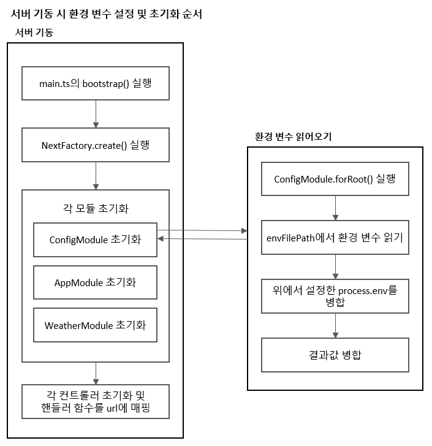
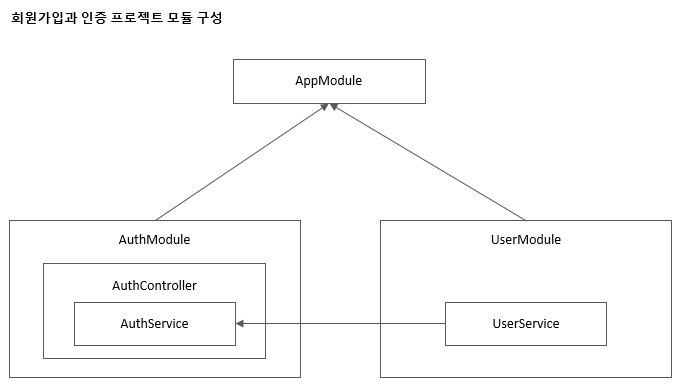

# Node.js로 백엔드 개발자 되기
> 백엔드 로드맵에서 엄선한 최신 테크 트리로 탄탄히 배우기


* 박승규, 2023.04, 골든래빗 (via.밀리의 서재)
---
### 00장 개발 환경 구축하기

#### _0.1 윈도우 개발 환경 구축
##### __0.1.1 Node.js 설치
##### __0.1.2 깃 설치
##### __0.1.3 비주얼 스튜디오 코드 설치

#### _0.2 맥OS 개발 환경 구축
##### __0.2.1 Node.js 설치
##### __0.2.2 깃 설치
##### __0.2.3 비주얼 스튜디오 코드 설치

#### _0.3 리눅스 개발 환경 구축
##### __0.3.1 Node.js 설치
##### __0.3.2 깃 설치
##### __0.3.3 비주얼 스튜디오 코드 설치

#### _0.4 예제 소스 코드 내려받기
#### _0.5 VSCode로 내려받은 소스 코드 실행하기

> P.42 아니 VSCode로 Ctrl+F5 눌러서 Debug Console까지 띄우는 건 성공 했는데, 닫는 건 왜 안보여주는지. 중지라는 것도 있을 것인데 말이지..

#### _0.6 VSCode 입문자를 위한 사용법 안내
##### __0.6.1 코드 실행하기
##### __0.6.2 디버깅하기
##### __0.6.3 VSCode 단축키
  * F9 - 해당 라인에서 브레이크 포인트 잡기
  * Ctrl + K, Ctrl + S -> 단축키 설정
  * Alt + Shift + A -> 블럭 주석처리 /* */
  * Shift + Alt + ↑ or ↓-> 같은 줄 추가
  * Ctrl + U -> 선택항목 취소

---

### 01장 알아두면 좋은 백엔드 개발자를 위한 지식
#### _1.1 백엔드 개발자가 알아야 하는 것
> 프레임워크는 개발에 필요한 예외처리, 데이터베이스 연결, 외부 라이브러리 연동 등의 기능을 추상화해 제공해주어 코드 구조의 일관성을 지키는 데 도움을 줍니다. 덕분에 개발자는 비즈니스 로직 개발에 더 집중할 수 있습니다.
> 백엔드 개발자가 코딩을 한다고 말할 대는 보통 프레임워크를 기반으로 요구사항에 필요한 코드를 추가한다는 의미입니다.

#### _1.2 백엔드 개발자의 업무
> 배포에도 방법이 여러개 : 롤링 배포, 블루 그린 배포(로드밸런서 설정 바꿔가며), 카나리 배포(특정 비율만 배포해보고 점점 늘려가는 배포)
> CI/CD는 데브옵스 엔지니어의 업무 중 하나
> 온콜 제도

#### _1.3 백엔드 아키텍처
> <소프트웨어 아키텍처 101>에서 '총체적이고 종합적이고 상세하게 개발을 준비하는 것'이라고 정의
> 이름은 '마이크로서비스'이지만 실제로 하나의 서비스를 운영하는 모든 구성을 갖추어야 하므로 유지보수하는데 비용이 많이 들어갑니다. 소규모 팀에서 마이크로서비스 아키텍처를 도입하고자 할 때는 면밀히 검토가 필요합니다.

#### _1.4 백엔드 프로그래밍 언어
#### _1.5 데이터베이스
##### __1.5.1 RDB
##### __1.5.2 NoSQL(Not Only SQL)
> 레디스는 싱글 스레드라서 오래 걸리는 작업을 하면 서버가 멈추게 됨. 반면 맴캐시드는 멀티 스레드임.

#### _1.6 클라우드 서비스
#### _1.7 자바스크립트 생태계
> 1995년 Mocha에서 시작.
##### __1.7.1 패키지 매니저
> npm은 용량문제, 속도문제, 보안문제 등으로 이를 개선한 yarn을 사용하기도.
##### __1.7.2 빌드 도구
##### __1.7.3 개발 도구
##### __1.7.4 웹 프레임워크
##### __1.7.5 백엔드 개발 환경
> Deno라는 것도 Node.js 창시자인 라이언 달이 만든 것. 코드 일관성은 더 좋음.

##### __1.7.6 인프라
#### _학습 마무리
#### _연습문제

---

## [레벨 2 Node.js와 Express로 백엔드 입문하기]

### 02장 Node.js로 백엔드 입문하기
#### _2.1 Node.js 소개

#### _2.2 Node.js는 서버에서 어떻게 자바스크립트를 실행할까?

##### __2.2.1 Node.js의 구성요소
##### __2.2.2 자바스크립트 실행을 위한 V8 엔진
##### __2.2.3 이벤트 루프와 운영체제 단 비동기 API 및
> 스레드 풀을 지원하는 libuv
##### __2.2.4 Node.js 아키텍처

#### _2.3 Node.js의 기술적인 특징
##### __2.3.1 싱글 스레드
##### __2.3.2 이벤트 기반 아키텍처
##### __2.3.3 이벤트 루프 (90)
> 반응자 패턴을 사용 reactor pattern, 이는 이벤트를 추가하는 주체와 실행하는 주체를 분리 decoupling 하는 구조. 반응자패턴에서는 이벤트 루프가 필수. node.js의 이벤트 루프는 libuv에 있음.
> 비유가 꽤 쓸만 했던 게, 메뉴 주문을 받는 사람과 커피 만드는 사람이 따로 있을 때, 주문행위 만큼은 기다리게 하지 않는다는 그런 거.

#### _2.4 Node.js 과연 쓸 만한가? (91)
> 페이팔, 넷플릭스, 우버, 링크드인, 나사, 네이버 등이 사용. 그러나 랭킹, 매칭 등 CPU를 많이 사용하는 서비스에는 적합하지 않음.
> 기본적으로 CPU를 하나만 사용. 멀티코어를 사용하려면 별도의 작업 필요.

#### _2.5 나의 첫 Node.js 서버 프로그램(94)
##### __2.5.1 hello.js 파일 생성 및 실행
##### __2.5.2 curl 내려받기 및 테스트해보기
* https://curl.se/windows/

#### _2.6 정말로 동시에 요청을 처리하는지 성능 테스트하기(97)
##### __2.6.1 K6 설치
* https://dl.k6.io/msi

##### __2.6.2 K6로 성능 테스트 스크립트 작성하기
> 싱글 스레드이면서도 동시에 여러 요청을 비동기로 처리.

#### _학습 마무리
#### _연습문제

---

### 03장 Node.js와 익스프레스로 웹 애플리케이션 서버 구현하기
#### _3.1 OK를 반환하는 서버 만들기 (105)
#### _3.2 라우터 만들기
#### _3.3 createServer( ) 리팩터링하기
#### _3.4 동적으로 응답하기

#### _3.5 라우터 리팩터링하기
* 맵을 활용하여 key를 넣으면, 함수가 반환되도록 설정
* urlMap 을 코드 하단에 추가한 것은 const로 선언한 변수들이 초기화 전엔 읽을 수 없기 때문.
    * 호이스팅 hoisting 은 클래스, 변수를 끌어올려서 선언되기 전에 사용할 수 있도록 함.
    * 그러나 const 로 선언된 것은 안됨. (Uncaught ReferenceError 발생)

#### _3.6 익스프레스 프레임워크 사용하기
##### __3.6.1 익스프레스 설치하기
* npm ls : 이 명령으로 의존성 확인이 가능.

##### __3.6.2 나의 첫 익스프레스 서버 만들기
* 여기 리팩토링에서는 function 선언자를 통해 함수를 만듦. 호이스팅을 이용하기 위해서.
* req 변수를 사용하지 않기때문에 뺄 수도 있으나, '_'(언더바)로 처리 한 것도 인상적이다. 관례적으로 그렇게 한단다.

##### __3.6.3 Node.js 라이브러리로 만든 서버를 익스프레스로 구현하기
* app.use(express.json()) 은 req.body를 사용할 수 있게 함.
* express.urlencoded({extended:true})는 컨텐트 타입이 application/x-www-form-urlencoded 인 경우 파싱 처리함.
* express.urlencoded({extended:true})타입이란 body에 키=값&키2=값2 같은 키=값 조합 형태를 가진 데이터를 말함.
* +id 처럼 사용하는 것은 문자열인 id를 숫형으로 변경한다는 뜻!! parseInt 사용하는 것과 같은 격.
* filter는 모던자바스크립트에서 배열에서 특정요소를 삭제하는 방법으로 주로 사용.
* if를 써서 return 하는 것을 early return 빠른 반환이라고 함. 이런 거.. 코드 가독성을 위해서도 좋음.
* 참고사항
    * https://developer.mozilla.org/en-US/docs/Web/JavaScript/Reference/Global_Objects/Array/map
    * https://developer.mozilla.org/en-US/docs/Web/JavaScript/Reference/Global_Objects/Array/splice
    * https://developer.mozilla.org/en-US/docs/Web/JavaScript/Reference/Global_Objects/Array/reduce
> 크롬 확장 프로그램 JSON Viewer 를 설치하면, JSON 포맷된 형태로 브라우저에서 편하게 볼 수 있음.

#### _3.7 익스프레스로 간단한 API 서버 만들기
##### __3.7.1 게시판 API 코드 작성하기
##### __3.7.2 API 규칙에 맞게 서버 구현하기
#### _3.8 게시판 API 테스트하기
##### __3.8.1 curl로 GET 호출하기
##### __3.8.2 curl로 POST를 호출해 게시글 등록하기
##### __3.8.3 curl로 DELETE를 호출해 게시글 삭제하기

#### _학습 마무리
#### _연습문제

---

### 04장 npm과 yarn으로 패키지 관리하기
#### _4.1 npm 소개
* <http://www.modulecounts.com> 이 사이트로 들어가면, 전 세계 패키지의 등록된 수와 트렌드를 볼 수 있음.
> 이런 걸 보면 격세지감인 게. 우물 안 개구리였다는 게지. (사이트 열릴 때 너무 느려서 고장 난 줄..)
> nuget도 이 전체 패키지들과 비교해서 보면, 그 수가 미미하달 수 밖에.
> PyPI는 어떻구. 최근엔 신규 추가 건이 없음. 뭔일 있나?

#### _4.2 패키지와 모듈
* 패키지 : package.json 으로 정의한 코드 뭉치
* 모듈 : node_modules 디렉터리 아래 있는 모든 것들. 여기 것들은 require() 함수로 읽을 수 있음.
* CommonJS는 브라우저 뿐 아니라 서버 애플리케이션에서도 모듈 기능을 제공하기 위해 나온 모든 규약.
> npm이 무거워지는 이유로 저자는 REPL에서 module.paths 를 쳐 보면 안다고 한다. 실행해 보니, npm은 현재 폴더에서 부터 상위로 가면서 node_module을 폴더를 모두 스캔하여 찾고 있다. 이게 무거워지는 원인이라고 한다. 이 대안으로 등장한 게 yarn 이란다.

#### _4.3 package.json 파일을 만들기
```
npm init
```
* 위 명령어로 만들면 package.json 파일이 하나 생성됨.
> 마크다운을 처리하며 공부하는데, VSCode에서 Markdown All in One 이라는 것을 깔고 보니, 엄청 편하다!
>> 이걸 보면서 VSCode 의 Extension을 어떻게 개발하는 지도 궁금했다. Gemini의 답은 의외로 간단했다. 나중에 시간이 되면 나도 하나 만들어봐야겠다 싶다.
* npm login, npm publish 등을 사용하면 배포까지 가능.
> Node.js 패키지들은 시맨틱 버전을 사용. <메이저>.<마이너>.<패치>
>> 추후에 package.json의 구성요소를 찾아보는 것도 좋을 듯.

#### _4.4 패키지 설치, 업데이트, 삭제

##### __4.4.1 패키지 설치하기
```
npm install [<@scope>]<name>@<tag/version/version range>
```
* 옵션에는 다음과 같은 것이 있음. -D (개발의존성), -g (프로젝트 디렉터리가 아닌 node가 설치된 곳에 의존성 패키지 설치 시)
```
npm install lodash
npm install lodash@latest
npm install lodash@4.17.21
npm install lodash@">=4.17.0 <4.20.0"
npm install jest -D
```
* package.json을 보면 jest 의 버전에 ^ 이 사용되었는데, 캐럿이라 부른다.
* 깃헙에서 다운로드받기도 함
```
npm install http://github.com/lodash/lodash
npm install http://github.com/lodash/lodash@4.17.21
```
##### __4.4.2 패키지 업데이트하기
```
npm update [-g] [패키지명1, 패키지명2 .. N]
```
* 버전에 ^이 사용된 것은 메이저이하는 모두 업데이트하겠다는 의미. 즉 1.X.X 일 경우, 2.0.0 미만까지는 모두받겠다는 의미임.
* ~ 틸드라고 읽으며, 현재 지정한 버전의 마지막 자리 내 범위만 자동으로 업데이트 하겠나는 의미. 즉 0.0.1 보다 크고, 0.1.0 보다 작은 범위만 업데이트 한다는 의미.

##### __4.4.3 설치한 패키지 확인하기
```
npm ls [@스코프/] 패키지명
```
* --depth=1 과 같이 사용하면, 의존성 패키지까지도 확인 가능.
> --depth=2 로 보다보면, deduped 라는 문구가 나옴. 이는 중복된 패키지가 제거되었다는 의미임. 이는 디스크 공간의 낭비를 방지하기 위함 같음.

##### __4.4.4 패키지 삭제하기
```
npm uninstall [@스코프/] 패키지명[@버전]
```
> 이부분에 대한 해설은 좀 짧은 것 같음. 다음 기회에 좀더 파 보면 될 것 같음.

#### _4.5 스크립트 기능과 NPX
* npm은 명령어를 지정해 실행하는 스크립트 기능도 제공
 
##### __4.5.1 npm 스크립트 파일을 정의하기
> package.json 과 같은 json 파일은 주석 사용이 불가함.
* scripts 라는 항목에 명령을 넣을 수 있음. pre 와  post를 전후로 사용하면, 호출될 때 실행전과 후로 각각 표시됨.

##### __4.5.2 NPX로 코드 포매팅 명령어 prettier 실행하기
* NPX는 Node Package eXecute의 약자. Node 패키지 실행자임.
* 본래 패키지를 실행하려면, node_modules/.bin/{패키지명} 경로로 명령어를 실행해야 하나, npx를 사용하면 npx {패키지명}을 경로를 생략해 실행할 수 있음.
> 갑자기 공부하다가 VSCode를 저장할 때, 포멧을 자동정렬하고 싶어서 설정 변경함.
```
npx prettier -w index.js
```
* 엉망진창 포맷을 바르게 정렬해 줌.
> 같은 포매팅을 사용해야 가독성이 높아지므로 파일 저장 시 혹은 저장소에 커밋이나 푸시하기 전에 자동으로 적용되도록 하면 유용할 듯 함.
> npx는 설치한 패키지 중 명령처럼 실행할 수 있는 패키지가 있다면, npx를 통해 편리하게 실행. npx는 패키지 러너임.

#### _4.6 패키지 잠금
* npm5 버전부터 package-lock.json 등장.
* Node.js 개발 시 꼭 필요한 패키지가 아니라면 설치하지 않는 것이 좋고, 너무 많은 의존성을 가진 패키지는 꼭 필요하지 않다면 사용하지 않는 것이 좋음. 패키지 의존성을 최소화 하는 것도 Node.js 개발에서 중요.
* npm ci 는 package-lock.json 만 참고해서 설치

#### _4.7 npm의 대안 yarn
* npm 패키지관리 문제를 해결할 목적으로 2016년 페이스북에서 만든 패키지 관리 프로그램.
* corepack enable 명령을 처리할 땐, 권한이 없다고 나와, 관리자 권한으로 cmd 열어서 처리함.
* 코어팩을 활성화 했다는 것은 npm 이외의 패키지 매니저 기능을 사용하겠다는 것.

#### _학습 마무리
#### _연습문제

---

### 05장 자바스크립트에서 비동기 처리하기

#### _5.1 자바스크립트 비동기 소개
* 콜백함수 : 요청이 끝난 후 실행할 함수를 매개변수로 추가
* 프로미스 : 객체를 반환하는 방식
* 어싱크 어웨이트 : 프로미스를 더욱 간단하게 async await라는 구문으로 변경한 문법.

#### _5.2 콜백 함수 소개
* 다음의 예제가 딱
```
const DB = [];

function register(user) {
    return saveDB(user, function (user) {
        return sendEmail(user, function (user) {
            return getResult(user);
        });
    });
}

function saveDB(user, callback) {
    DB.push(user);
    console.log(`save ${user.name} to DB`);
    return callback(user);
}

function sendEmail(user, callback) {
    console.log(`email to ${user.email}`);
    return callback(user);
}

function getResult(user) {
    return `success register ${user.name}`;
}

const result = register({ email: "andy@test.com", password: "1234", name: "andy" });
console.log(result);
```

#### _5.3 Promise 객체
* 비동기 실행을 동기화 하는 구문으로 사용. 약속은 세가지 상태를 가짐. 이행, 거절, 대기.
* Promise는 객체이므로 new 연산자로 인스턴스로 생성.
* * resolve() 함수가 실행되면 이행
* * reject() 함수가 실행되면 거절로 변경
```
const DB = [];

function saveDB(user) {
    const oldDBSize = DB.length;
    DB.push(user);
    console.log(`save ${user.name} to DB`);
    return new Promise((resolve, reject) => {
        if (DB.length > oldDBSize) {
            resolve(user);
        } else {
            reject(new Error("Save DB Error!"));
        }
    });
}

function sendEmail(user) {
    console.log(`emailt to ${user.email}`);
    return new Promise((resolve) => {
        resolve(user);
    });
}

function getResult(user) {
    return new Promise((resolve, reject) => {
        resolve(`success register ${user.name}`);
    });
}

function registerByPromise(user) {
    const result = saveDB(user)
        .then(sendEmail)
        .then(getResult)
        .catch(error => new Error(error))
        .finally(() => console.log("완료!"));
    console.log(result);
    return result;
}

const myUser = { email: "andy@test.com", password: "1234", name: "andy" };
const result = registerByPromise(myUser);
result.then(console.log);
```

##### __5.3.1 동시에 여러 Promise 객체 호출하기
* Promise.all() 안에 배열로 호출함수 넣음.

##### __5.3.2 Promise 예외 처리하기
* then 뒤에 chatch, finally 연결. 이런걸 체이닝 방식이라고~

##### __5.3.3 프로미스의 문제점
> 여기서 axios 를 설치해 사용함.
> 실습하면서 계속 느끼는 건데, 다음의 오류를 만나면.. 정말 해당 폴더에 파일, 모듈이 없는 것이라고 인식할 것.. 당황하지 말고!!
```
node:internal/modules/cjs/loader:959
  throw err;
  ^
  ...
  code: ?[32m'MODULE_NOT_FOUND'?[39m,
  requireStack: []
```
#### _5.4 async await 구문
* 현재 가장 최신의 비동기 처리 문법
```
for (let x of [...Array(10).keys()]) {
  // ...
}
```
> * keys() 배열의 키 목록을 반환
> * ... 연산자가 신기한데, 배열의 키목록을 숫자값으로 변환한다는 의미
* top 20 개 영화 순위를 보여주는 예제
```
const axios = require("axios");
const url = "https://raw.githubusercontent.com/wapj/jsbackend/main/movieinfo.json";

async function getTop20Movies(url) {

    try {
        const result = await axios.get(url);
        const { data } = result;
        if (!data.articleList || data.articleList.size == 0) {
            throw new Error("데이터가 없습니다.");
        }
        const movieInfos = data.articleList.map((article, idx) => {
            return { title: article.title, rank: idx + 1 };
        });
        for (let movieInfo of movieInfos) {
            console.log(`[${movieInfo.rank}위 ${movieInfo.title}]`);
        }
    } catch (err) {
        throw new Error(err);
    }
}

getTop20Movies(url);
```
* Promise가 필요한 경우는 setTimeout() 사용시나, 여러 태스크를 동시에 실행하는 경우. 이 이외에는 모두 async await를 사용. 읽기 편한 코드는 디버깅에 유리.
* async, await는 내부적으로는 제너레이터를 활용해 동작. <https://url.kr/ogculf>

#### _학습 마무리
#### _연습문제

---

### 06장 NoSQL 데이터베이스 몽고디비 사용하기
#### _6.1 몽고디비 소개
##### __6.1.1 데이터베이스 기본 용어
##### __6.1.2 몽고디비 특징
* 예전에는 MEAN 스텍 (몽고디비+익스프레스+앨귤러+엔진엑스) 스펙이 인기가 많았다고.
* 몽고디비는 자바스크립트에 친화적.

#### _6.2 몽고디비 아틀라스 설정하기
> 이 책은 비동기관련해서 async await 를 사용하지만, 예외적으로 간단한 처리는 콜백 함수를 사용.

#### _6.3 몽고디비 CRUD API 만들기
> 실제 접속부분에서 이 책에서 제안해 준 userNewUrlParser는 더이상 넣을 필요 없는 옵션임.
```
const MongoClient = require('mongodb').MongoClient;
const url = "mongodb+srv://sty**:<패스워드>@cluster0.qofpazq.mongodb.net/?retryWrites=true&w=majority&appName=Cl***";
const client = new MongoClient(url, { /*useNewUrlParser: true*/ });
```

#### _6.4 몽고디비 콤파스로 데이터 확인하기
* 몽고DB전용 GUI 시스템 <https://www.mongodb.com/try/download/compass> 다운로드!

#### _6.5 몽구스를 사용해 CRUD 만들기
* Node.js와 몽고디비간 네이티브 몽고 드라이브 만큼 많이 사용하는 몽구스!

##### __6.5.1 몽구스 설치하기
* 대표적으로 객체를 도큐먼트로 매핑하는 ODM (Object Document Mapper) 기능
* 몽고디비 자체에는 스키마 설정 기능이 없지만, 몽구스는 있다!
* * 이로써 유효성 검증을 할 수 있는 것!
```
npm install mongoose
```

##### __6.5.2 몽구스로 스키마 만들기

##### __6.5.3 몽구스와 익스프레스로 CRUD API 만들기

#### _6.6 REST 클라이언트로 API 테스트하기
> 이부분의 테스트가 많이 아쉬운 것은 실제로 HTTP Client를 설치했음에도 동작이 안됐다는 거다. 그리고 몽구스 설명, 설치 다 좋았는데.. 이쯤에서 드는 생각이, 살짝 수박 겉할기 같달까? 그럼에도 백엔드에서 익혀야 할 것이 이토록 많다는 게, 버거움을 준다.

#### _학습 마무리
#### _연습문제

---

### 07장 페이지네이션되는 게시판 만들기
#### _7.1 프로젝트 구조 소개
#### _7.2 게시판 프로젝트 셋업
##### __7.2.1 Node.js 프로젝트 초기 설정
##### __7.2.2 익스프레스 설치 및 프로젝트 디렉터리 구조 잡기
> 컨트롤러의 역할이 인증, 유효성 검증 등을 하고 문제가 없다면 비즈니스 로직을 처리하는 서비스 계층으로 함수를 호출하는 역할. 가끔 이런 컨트롤의 역할을 잊고.. 거기다가 모두 구현하는 경우도 왕왕 있음.

##### __7.2.3 핸들바 템플릿 엔진 설치 및 설정하기
* 익스프레스에서 사용하는 템플릿 엔진은 Pug, EJS, Mustache, handlebar 등이 있음.
  ```
  npm i express-handlebars@6.0.3
  ```

#### _7.3 화면 기획하기
##### __7.3.1 리스트 화면 기획
##### __7.3.2 글쓰기 화면 기획
##### __7.3.3 상세 화면 기획
#### _7.4 UI 화면 만들기
##### __7.4.1 리스트 UI 만들기
##### __7.4.2 글쓰기 UI 만들기
##### __7.4.3 상세페이지 UI 만들기
#### _7.5 API 만들기
##### __7.5.1 몽고디비 연결을 위한 유틸리티 만들기
```
const { MongoClient } = require("mongodb");
const uri = "mongodb+srv://sty**:<패스워드>@cluster0.qofpazq.mongodb.net/?retryWrites=true&w=majority&appName=Cluster0/board";

module.exports = function (callback) {
    return MongoClient.connect(uri, callback);
}
```
* 생성한 커넥션js는 아래와 같이 app.js에 연결
```
const mongodbConnection = require("./configs/mongodb-connection");
```

##### __7.5.2 UI 페이지에서 사용할 핸들바 커스텀 헬퍼 만들기
* 커스텀 헬퍼를 만들어 연결
```
// app.engine("handlebars", handlebars.engine());

app.engine(
    "handlebars",
    handlebars.create({
        helpers: require("./configs/handlebars-helpers"),
    }).engine,
);
```

##### __7.5.3 nodemon 설정하기
* 서버 코드를 작성하면, 서버 재기동을 자동으로 해주는 기능
```
npm i nodemon@2.0.20
```
* 이어 package.json 에서 다음과 같이 처리
```
  "scripts": {
    "start": "npx nodemon app.js",
  }
```

* 유매니저가 가르쳐준 설정
```
nvm for windows (node, yarn 설치할 필요없음)

nvm install 16.17.1
nvm install 12.22.9

nvm list
nvm use 12.22.9

npm install -g yarn

yarn install
npm install

node -v
npm -v
```


##### __7.5.4 글쓰기 API 만들기

##### __7.5.5 리스트 API 만들기
> 실습을 하다보니, 다음과 같은 생소한 코드를 만난다. A || B 라는 A 아니면, B 라는 형태의 변수할당이 이 세계에는 존재하는가 보다.
```
app.get("/", async (req, res) => {
    // res.render("home", { title: "테스트 게시판" });
    const page = parseInt(req.query.page) || 1;
    const search = req.query.search || "";
    ...
```
> home.handlebars 를 수정하면서, 내장함수가 언급된다. 화면에 목록을 표출하기 위해 사용하는 {{each}} 와 {{with}} 가 그것이다. 이와 더불어 앞전에 개발해 놓은 handlebars-helpers도 여기에 등장한다. 이런 것들이 각 node.js 모듈마다 응용법, 사용법이 다를 수 밖에 없으니, 항상 그려려니 하는 마음으로 코드를 볼 줄 알아야 할 것 같다.

##### __7.5.6 상세페이지 API 만들기
##### __7.5.7 글 수정 API
* javascript의 펼침연산자 (spread operator) 모르면 못쓰는 기능.
```
    const postOption = {
        method: 'POST',
        headers: {
            'Content-Type': 'application/json',
        },
    }

    async function modifyPost() {

        ..<중간생략>..

        const result = await fetch("/check-password", {
            ...postOption,
            body: JSON.stringify({ id:"{{post._id}}", password })
        });
```
* 결국 위의 결과는 아래와 같은 것.
```
    async function modifyPost() {

        ..<중간생략>..

        const result = await fetch("/check-password", {
            {
                method: 'POST',
                headers: {
                    'Content-Type': 'application/json',
                }
            },
            body: JSON.stringify({ id:"{{post._id}}", password })
        });
```
* 위의 body에서 JSON.stringify 을 사용하는 이유는 HTTP 프로토콜이 JSON타입을 알지 못하므로 문자열 형태로 변경하기 위해 조치하는 것임. (이 이유가 늘 궁금하긴 했음. 발음은 스트링어파이)

##### __7.5.8 글 삭제 API
##### __7.5.9 댓글 추가 API
> POST이면 req에 body 데이터가 담김.
##### __7.5.10 댓글 삭제 API
* fetch API를 사용해 Ajax 통신을 함.

#### _학습 마무리
#### _연습문제

---

## [레벨 3 NestJS 프레임워크로 점핑하기]

### 08장 NestJS 시작하기

#### _8.1 왜 NestJS가 필요할까?
* NestJS 프레임워크는 누구든 비슷하게 설계하도록 아키텍처 문제를 해결하도록 하는 데 중점을 두고 있음.

#### _8.2 NestJS 소개
* Node.js에서 실행하는 서버 사이드 프레임워크.
* 타입스크립트를 완벽 지원
* 자바스크립트 최신 스펙 지원.
* HTTP 요청부분은 추상화 코드를 지원, 익스프레스와 패스티파이 사용할 수 있음.
  * 패스티파이 (<https://www.fastify.io/>) 는 익스프레스와 히피에 영감 받은 프레임워크. 고성능, 확장성, 스키마 기반, 로깅(pino), 개발자 친화적임. 

##### __8.2.1 익스프레스와 NestJS 비교하기
* 자바스크립트 최신 기능을 사용한 효율성 추구. 상업용 서버 애플리케이션 구축을 목표로 하는 프레임워크.
  * 쉽게 테스트하고, 쉽게 확장 가능하고, 각 모듈 간의 의존성을 줄이도록 해야 유지보수가 쉬은 좋은 아키텍처임. 
* 라우터에 @Controller() 데코레이터 사용
* 아키텍처는 컨트롤러, 프로바이더, 모듈을 사용한 애플리케이션 아키텍처 제공

##### __8.2.2 NestJS 둘러보기
* 핵심기능으로 의존성 주입. 모듈 간의 결합도를 낮춰서 코드의 재사용을 용이하게 함. 모듈 내에서는 코드의 응집도를 높임.
  * 이를 위한 장치로 모듈, 가드, 파이프, 미들웨어, 인터셉터 같은 모듈과 코드의 의존관계를 구성하는 프로그래밍적 장치들을 구비.
  * 기존의 Node.js 생태계에서 자주 사용하는 기능을 통합. RDB, NoSQL 연동, 세션 처리, 문서화, 테스트 지원, 로깅, 테스크 스케줄링 등 상업용 서버에 필요한 대부분의 기능을 제공.
  * 새로 필요한 기능이 있다면 모듈이나 커스텀 데코레이터를 만들어서 다른 코드들에 손쉽게 적용.
* NestJS는 @를 활용한 데코레이터를 자주 씀.
* Express 기반 미들웨어를 거의 대부분은 사용. 성능이 중요하다면, Fastify로 교체하면 됨. 같이 쓰는 것도 가능.
* 국내에서는 당근, 배달의민족. 해외에서는 오토데스크, 깃랩, 레드햇, IBM, 젯브레인이 사용.

#### _8.3 NestJS 설치하고 실행하기
* 설치방법 3가지
  * 직접 npm 으로 내려 받기 (8.3 은 이것으로)
  * nest cli 로 내려 받기 (8.4 부터는 이것으로)
  * github 이용한 내려 받기

##### __8.3.1 의존성 패키지 설치하기
```
npm i @nestjs/core @nestjs/common @nestjs/platform-express reflect-metadata typescript
```
* 기본구성 package.json 내부
```
{
  "dependencies": {
    "@nestjs/common": "^10.3.3",
    "@nestjs/core": "^10.3.3",
    "@nestjs/platform-express": "^10.3.3",
    "reflect-metadata": "^0.2.1",
    "typescript": "^5.3.3"
  }
}
```
* 타입스크립트 위한 tsconfig.json 생성
```
{
    "compilerOptions": {
        "module": "CommonJS",
        "target": "ESNEXT",
        "experimentalDecorators": true,
        "emitDecoratorMetadata": true
    }
}
```

##### __8.3.2 타입스크립트 설정하기
* NestJS의 단계별 대응
  * 가드 -> 인터셉터 -> 파이프 -> 컨트롤러 -> 서비스 -> 리포지토리
* 대응별 역할
  * 파이프 : 요청에 대한 유효성 검증
  * 가드 : 인증/인가
  * 컨트롤러 : 특정 함수에 값을 전달(라우팅)
  * 서비스 : 비즈니스 로직
  * 리포지토리 : 데이터 저장
  
##### __8.3.3 NestJS의 모듈과 컨트롤러 만들기
##### __8.3.4 hello-nest 앱 실행시켜보기
* NestJs에서 진입점으로 bootstrap()으로 이름 짓는 건 관행.
* app.listen(3000)은 NestJs 에서 사용하는 코드가 익스프레스와 같기 때문.
* 타입스크립트로 만든 프로그램을 실행하려면 다음 패키지 필요
```
npx ts-node-dev src/main.ts
```

##### __8.3.5 NestJS의 네이밍 규칙
* 파일은 . 으로 연결. 모듈이 둘 이상의 단어로 구성되어 있으면, 대시로 연결
    ```
    //<모듈명>.<컴포넌트명>
    hello.controller.ts
    my-first.controller.ts
    ```
* 클래스명은 낙타 표기법Camel Case
    ```
    //<모듈명><컴포넌트명>
    HelloController
    ```
* 같은 디렉터리에 있는 클래스는 index.ts를 통해 임포트하는 것을 권장
    ```
    // index.ts를 사용하지 않는 경우
    import { MyFirstController } from './controllers/my-first.controller'
    import { MySecondController } from './controllers/my-second.controller'

    // index.ts를 사용하는 경우
    import { MyFirstController, MySecondController } from './controllers'
    ```
* 타입스크립트에서는 인터페이스를 많이 사용. ISeries 처럼 하지 않고 Series로 작명
    ```
    interface Series {}
    interface BookSeries extends Series {}
    class MovieSeries extends Series {}
    ```
#### _8.4 NestJS로 웹 API 만들기
* 블로그 만들기 실행 (8.4-API만들기, 8.5-의존성주입, 8.6-몽고DB연결).

##### __8.4.1 프로젝트 생성과 설정
* nest-cli는 CLI 프로그램이므로 global 옵션을 사용해 어디서든 사용가능하도록 해야 함.
```
npm install -g @nestjs/cli
```
* 프로젝트 생성
```
nest new blog
```
> 위 설치 중 에러가 발생했다. 원인을 찾아보니 KT 망 문제라는 지적이 많다. DNS를 8.8.8.8 로 변경하니 바로 되네..
* 프로젝트 설치 확인 (./blog/main.ts 시작 파일)
```
cd blog
npm install
npm run start
```
##### __8.4.2 컨트롤러 만들기
##### __8.4.3 블로그 API 작성하기
##### __8.4.4 메모리에 데이터를 저장하는 API 만들기
```
npm run start:dev
```
##### __8.4.5 파일에 정보를 저장하도록 API 업그레이드하기
> 파일에 저장하는 이 로직은 거의 공통으로 어디에서나 사용가능 할 것 같다. 너무 간단하고 유용한 로직이다. DB가 없는 환경에서 사용하면 좋을 것 같다.

#### _8.5 의존성 주입하기
> 의존성 주입이 사실 아직도 잘 이해가 안가는 부분이지만, 이 내용들을 유심히 들여다보면 뭔가 보일 것만 같다. DB로의 연결로 교체 하려면, 어디를 바꾸면 될 것이지 대략 그려지는 것.

#### _8.6 몽고디비 연동하기
* 몽고DB를 연결하려면 NestJS 환경 하에서 TypeORM을 사용해 connector를 몽고디비로 사용하거나 Mongoose를 사용하는 방법 두 가지.

##### __8.6.1 의존성 설치
```
npm install @nestjs/mongoose mongoose
```
##### __8.6.2 스키마 만들기
##### __8.6.3 몽고디비를 사용하는 리포지토리 추가하기
##### __8.6.4 서비스 코드 변경
##### __8.6.5 모듈에 몽고 디비 설정과 프로바이더 설정 추가하기
> 여전히 프로바이더나 의존성주입은 여전히 그 개념이 어렵다. 유추해 보건에 20년 전, .Net 개발할 때에도 이놈의 프로바이더는 들어본 것 같다.

#### _학습 마무리
* 데코레이터 : 최근 자바스크립트의 기능으로 함수나 클래스에 붙여서 특정한 기능을 수행.
* DTO : Data Transfer Object의 약자로 데이터만 담고 있는 객체.
* 의존성 주입 : 객체를 직접 생성하지 않고 생성자나 필드 선언에 데코레이터를 추가해 의존성 객체를 주입하는 것.
#### _연습문제

---

### 09장 NestJS 환경 변수 설정하기
#### _9.1 환경 변수 소개
#### _9.2 프로젝트 생성 및 설정하기
#### _9.3 NestJS 설정 및 테스트하기
##### __9.3.1 app.module.ts에 ConfigModule 설정하기
* ConfigModule 설정 (app.module.ts)
```
import { Module } from '@nestjs/common';
import { ConfigModule } from '@nestjs/config';
import { AppController } from './app.controller';
import { AppService } from './app.service';

@Module({
  imports: [ConfigModule.forRoot()],
  controllers: [AppController],
  providers: [AppService],
})
export class AppModule {}

```
* ConfigModule.forRoot() 함수 옵션

| 옵션          | 설명                                                                           |
| ------------- | ------------------------------------------------------------------------------ |
| cache         | 메모리 환경변수를 캐시할지 여부, 애플리케이션의 성능을 향상                    |
| isGlobal      | true이면 global module로 등록되어, 다른 모듈에서 임포트를 따로 해주지 않아 됨. |
| ignoreEnvFile | true이면 .env 파일이 무시됨                                                    |
| ignoreEnvVars | true이면 환경 변수가 무효화됨                                                  |
| envFilePath   | 환경 변수 파일(들)의 경로                                                      |
| encoding      | 환경 변수 파일의 인코딩                                                        |
| validate      | 환경 변수의 유효성 검증 함수                                                   |
| load          | 커스텀 환경 설정 파일을 로딩 시에 사용 (ts 파일, YAML 파일 등)                 |

##### __9.3.2 .env 파일 생성하기
* 프로젝트 루트 디렉터리에 .env 파일 생성하고 아래 내용 삽입
```
MESSAGE=hello nestjs
```
##### __9.3.3 app.controller.ts에 코드 추가하기
* getHello() 함수 수정
```
import { Controller, Get } from '@nestjs/common';
import { ConfigService } from '@nestjs/config';

@Controller()
export class AppController {
  constructor(private configService: ConfigService) { }

  @Get()
  getHello(): string {
    const message = this.configService.get('MESSAGE');
    return message;
  }
}
```
##### __9.3.4 테스트하기
> 아직도 이것을 테스트 하면서 적응이 안되는 건. 에러가 났고, 문제를 아무리 보아도 문제가 안찾아지는 것인데.. 여전히 문제는 안 없어 지는 것. 그리고 발견된 문제. 수정한 파일을 저장하니 않은 것! 오타만이 문제가 아니었던 듯함.
#### _9.4 ConfigModule을 전역 모듈로 설정 하기
```
  imports: [ConfigModule.forRoot({ isGlobal: true })],
```
* 잘 동작하는지 테스하기 위해 다음 시나리오 대로 설정
  > 1 env에 환경변수 설정 2 weather 모듈 생성 3 핸들러 함수 만들어 테스트

##### __9.4.1 .env에 환경 변수 설정하기
* 외부 API의 환경변수를 추가
```
WEATHER_API_URL=http://api.openweathermap.org/data/2.5/forecast?id=524901&appid=WEATHER_API_KEY=my_weather_api_key
```
##### __9.4.2 weather 모듈 만들기
* nest를 통해 module과 controller를 생성. 
> 이렇게 만드니, 자연스럽게 module에 등록되 됨!!!
```
$ nest g module weather
CREATE src/weather/weather.module.ts (88 bytes)
UPDATE src/app.module.ts (421 bytes)
$ nest g controller weather --no-spec
CREATE src/weather/weather.controller.ts (107 bytes)
UPDATE src/weather/weather.module.ts (182 bytes)
```
##### __9.4.3 날씨 API 테스트용 핸들러 함수로 테스트하기
* 클래스에서 사용할 수 있도록 configService를 주입한다고 표현!!
```
import { Controller, Get } from '@nestjs/common';
import { ConfigService } from '@nestjs/config';

@Controller('weather')
export class WeatherController {
    constructor(private configService: ConfigService) { } // 주입

    @Get()
    public getWeather(): string {
        const apiUrl = this.configService.get('WEATHER_API_URL');
        const apiKey = this.configService.get('WEATHER_API_KEY');

        return this.callWheatherApi(apiUrl, apiKey);
    }

    private callWheatherApi(apiUrl: string, apiKey: string): string {
        console.log('날씨 정보 가져오는 중...');
        console.log(apiUrl);
        console.log(apiKey);
        return '내일은 맑음';
    }
}

```
> 솔직히 weather 모듈에서 configService를 사용하려면, ConfigModule을 따로 임포트해야 하는데, 전역으로 설정해 놨기 대문에 따로 임포트 하지 않아도 된다고 한다. 그런데.. 아직 이해가 안감. configService를 호출하는데가 아무데도 없는데..

#### _9.5 여러 환경 변수 파일 사용하기
* 개발용, QA용, 운영용으로 나누기
##### __9.5.1 환경별로 서버가 기동되도록 스크립트 수정하기
* package.json 의 script 항목에 수정
```
    "start": "set NODE_ENV=local&& nest start",
    "start:dev": "set NODE_ENV=dev&& nest start --watch",
    "start:debug": "nest start --debug --watch",
    "start:prod": "set NODE_ENV=prod&& node dist/main",
```
##### __9.5.2 local, dev, prod 환경 변수 생성
* envs 폴더를 만들고 하위에 prod.env, dev.env, local.env 등을 생성
* 각각의 파일에는 아래와 같은 SERVICE_URL 환경변수 지정
```
SERVICE_URL=http://localhost:3000
```
##### __9.5.3 환경 변수에 따라서 다른 환경 변수 파일을 사용하도록 설정 수정하기
* app.module.ts 수정
```
..생략..
@Module({
  imports: [
    ConfigModule.forRoot({
      isGlobal: true,
      envFilePath: `${process.cwd()}/envs/$${process.env.NODE_ENV}.env`,
    }),
    WeatherModule,
  ],
..생략..
```
* process.cwd()는 현재 디렉터리의 절대 경로 출력.
##### __9.5.4 테스트용 핸들러 함수로 테스트하기
```
npm run start
npm run start:dev
npm run start:prod
```
* 위 내용으로 각각 실행 후, url에서 다음을 호출하여, service-url 각기 다르게 찍히는 확인 : <http://localhost:3000/service-url>
#### _9.6 커스텀 환경 설정 파일 사용하기
* 왠만하면 .env 확장자로 되지만, 복잡한 설정이 필요할 때 .ts이나 YAML 파일로도 가능
##### __9.6.1 환경 변수 파일 생성하기
* src/configs 디렉터리를 생성한 후, common.ts, local.ts, dev.ts, prod.ts, config.ts 등을 생성. 이 다섯 파일에 다음과 같은 내용들을 입력
* common.ts
```
export default {
    logLevel: 'info',
    apiVersion: '1.0.0',
    MESSAGE: 'hello',
}
```
* local.ts
```
export default {
    dbInfo: 'http://localhost:3306',
}
```
* dev.ts
```
export default {
    logLevel: 'debug',
    dbInfo: 'http://dev-mysql:3306',
}
```
* prod.ts
```
export default {
    logLevel: 'error',
    dbInfo: 'http://prod-mysql:3306',
}
```
* config.ts
```
import common from './common';
import local from './local';
import dev from './dev';
import prod from './prod';

const phase = process.env.NODE_ENV;

let conf = {};
if (phase === 'local') {
    conf = local;
} else if (phase === 'dev') {
    conf = dev;
} else if (phase === 'prod') {
    conf = prod;
}

export default () => ({
    ...common,
    ...conf,
});
```
##### __9.6.2 ConfigModule에 load 옵션 추가하기
* app.modue.ts 에서 다음과 같이 load 옵션 추가
```
..생략..
import config from './configs/config';
..생략..
    ConfigModule.forRoot({
      isGlobal: true,
      envFilePath: `${process.cwd()}/envs/${process.env.NODE_ENV}.env`,
      load: [config],
    }),
..생략..
```
##### __9.6.3 커스텀 환경 변수 읽기 테스트하기
* 이제 테스트하기 위해 app.controller.ts에 다음과 같이 수정
```
  @Get('db-info')
  getTest(): string {
    console.log(this.configService.get('logLevel'));
    console.log(this.configService.get('apiVersion'));
    return this.configService.get('dbInfo');
  }
```
* 아래 내용으로 각각 실행 후, url에서 다음을 호출하여, dbInfo 각기 다르게 찍히는 확인 : <http://localhost:3000/db-info>
```
npm run start
npm run start:dev
npm run start:prod
```
> 개인적으로 이런 설졍의 영역은 개발자들이 아닌 아키텍처의 영역인가 싶었는데, 이런 방법으로 분할 설정하는 것을 보게 된 게 행운 같음!

#### _9.7 서버 기동과 환경 설정 파일 초기화 순서 알아보기

* 모듈별 초기화 순서는 프로젝트에 따라 다를 수 있음.

#### _9.8 YAML 파일을 사용해 환경 변수 설정하기
* ConfigModule이 YAML 파일을 읽으려면, 9.6의 커스텀 환경 설정 파일에서 YAML 파일을 읽어도록 코드 수정 필요. (js-yaml 패키지 설치, config.ts 수정 필요)
##### __9.8.1 js-yaml 설치하기
```
npm i js-yaml
npm i -D @types/js-yaml  // 타입정보를 저장할 수 있게
```
##### __9.8.2 config.yaml 파일 생성하기
* envs/config.yaml 파일을 생성하고 다음을 입력
> 책의 경로가 잘못된 듯 함.
```
http:
  port: 3000

redis:
  host: 'localhost'
  port: 6379
```
##### __9.8.3 config.ts 수정하기
* YAML 파일은 커스텀 설정 파일로 취급되므로, 9.6에서 만든 config.ts에 설정 추가
```
..생략..
import * as yaml from 'js-yaml';
..생략..
const yamlConfig: Record<string, any> = yaml.load(
    readFileSync(`${process.cwd()}/envs/config.yaml`, 'utf8'),
);

export default () => ({
    ...common,
    ...conf,
    ...yamlConfig,
});
```
##### __9.8.4 테스트용 핸들러 함수로 테스트하기
* 테스트를 하기 위해 app.controller.ts 수정
```
..생략..
  @Get('redis-info')
  getRedisInfo(): string {
    return `${this.configService.get('redis.host')}:${this.configService.get('redis.port')}`;
  }
```
#### _9.9 캐시 옵션 사용하기
* 설정파일은 캐시를 사용하면 성능상 좋음.
```
    ConfigModule.forRoot({
    ... 생략
      cache: true,
    }),
```
#### _9.10 확장 변수 사용하기
* 확장변수는 이미 선언된 변수를 다른 변수에 ${변수명}으로 할당 하는 기능
```
SERVER_DOMAIN=localhost
SERVER_PORT=3000
SERVICE_URL=http://${SERVER_DOMAIN}:${SERVER_PORT}
```
##### __9.10.1 확장 변수를 사용할 수 있게 추가 설정하기
* ConfigModule에 expandVariables 옵션을 추가해야 함.
```
    ConfigModule.forRoot({
    ... 생략
      expandVariables: true,
    }),
```
##### __9.10.2 테스트용 핸들러 함수로 테스트하기
#### _9.11 main.ts에서 환경 변수 사용하기
* main.ts에서 수정
```
..생략..
async function bootstrap() {
  const app = await NestFactory.create(AppModule);
  const configService = app.get(ConfigService);
  await app.listen(configService.get("SERVER_PORT"));
}
bootstrap();
```
#### _학습 마무리
##### 핵심용어설명
1. 환경설정파일 : 애플리케이션에서 사용하는 각종 정적인 값을 저장한 파일
2. ConfigModule : NestJS의 환경 설정에 사용하는 모듈
3. ConfigService : 애플리케이션의 환경 변수를 읽어들이는 서비스
4. NODE_ENV : Node.js 애플리케이션에서 주로 사용하는 환경 변수이름.
5. YAML : 환경 설정용 파일 포멧. JSON 보다 간단한 문법. JSON과 완벽 호환. 주석지원
6. 확장변수 : 환경 변수를 다른 환경 변수의 값에 변수로 포함시키는 기능
7. .env 파일 : NestJS의 기본 환경 변수 파일. NestJS에서는 내부적으로 dotenv 라이브러리를 사용
##### 추가로 알아보기
1. 민감안 환경변수를 관리하는 설정파일 저장소 vault : <https://www.vaultproject.io>
2. 서버간 설정을 동기화하는 주키퍼 서버 : <https://zookeeper.apache.org/>
3. NestJS 설정 공식문서 : <https://docs.nestjs.com/techniques/configuration>
#### _연습문제

---

### 10장 회원 가입과 인증하기
* 인증(Authentication)과 인가(Authorization)차이 이해.
* 인가는 본 범위가 아님. <https://docs.nestjs.com/security/authorization> 참고
#### _10.1 실습용 프로젝트 설정하기
##### __10.1.1 nest-cli로 프로젝트 생성하기
```
nest new nest-auth-test
```

##### __10.1.2 User 모듈 생성하기
```
cd nest-auth-test
nest g module user
nest g controller user --no-spec
nest g service user --no-spec
```
##### __10.1.3 SQLite 데이터베이스 설정하기
* SQLite 엘 필요한 sqlLite3, typeorm, @nestjs/typeorm 을 설치
```
npm install sqlite3 typeorm @nestjs/typeorm
```
* app.module.ts 수정
```
..생략..
@Module({
  imports: [
    TypeOrmModule.forRoot({
      type: 'sqlite',
      database: 'nest-auth-test.sqlite',
      entities: [],
      synchronize: true,
      logging: true,
    }),
    UserModule,
  ],
..생략..
```
* 데이터베이스별 타입 및 확장자
| 이름          | 타입      |
| ------------- | ---------- |
| SQLite | 'sqlite'  |
| MySql | 'mysql'  |
| PostgreSql | 'postgres'  |
| CockroachDB | 'cockroachdb'  |
| Oracle | 'oracle'  |
| MS SQL | 'sqlserver'  |
| SAP/HANA | 'sap'  |
| sql.js | 'sqljs'  |

#### _10.2 유저 모듈의 엔티티, 서비스, 컨트롤러 생성하기
##### __10.2.1 엔티티 만들기
##### __10.2.2 컨트롤러 만들기
##### __10.2.3 서비스 만들기
##### __10.2.4 테스트하기

#### _10.3 파이프로 유효성 검증하기
##### __10.3.1 전역 ValidationPipe 설정하기
##### __10.3.2 UserDto 만들기
##### __10.3.3 테스트하기

#### _10.4 인증 모듈 생성 및 회원 가입하기
##### __10.4.1 인증 모듈 만들기 및 설정하기
##### __10.4.2 회원 가입 메서드 만들기
##### __10.4.3 sqlite 익스텐션으로 테이블 확인하기

#### _10.5 쿠키를 사용한 인증 구현하기
##### __10.5.1 AuthService에 이메일과 패스워드 검증 로직 만들기
##### __10.5.2 가드를 사용해 인증됐는지 검사하기

#### _10.6 패스포트와 세션을 사용한 인증 구현하기
##### __10.6.1 라이브러리 설치 및 설정
##### __10.6.2 로그인과 인증에 사용할 가드 구현하기
##### __10.6.3 세션에 정보를 저장하고 읽는 세션 시리얼라이저 구현하기
##### __10.6.4 email, password 인증 로직이 있는 LocalStrategy 파일 작성하기
##### __10.6.5 auth.module.ts에 설정 추가하기
##### __10.6.6 테스트하기
##### __10.6.7 로그인과 세션 저장까지 순서
#### _학습 마무리
#### _연습문제

---

### 11장 OAuth를 사용한 구글 로그인 인증하기

#### _11.1 OAuth 소개
##### __11.1.1 OAuth 프로토콜 흐름
##### __11.1.2 액세스 토큰을 재발행하는 흐름

#### _11.2 구글 OAuth를 사용하기 위한 준비하기
##### __11.2.1 구글 클라우드에서 프로젝트 생성하기
##### __11.2.2 OAuth 동의 화면을 만들기
##### __11.2.3 OAuth 클라이언트의 ID와 비밀번호 만들기

#### _11.3 구글 OAuth 구현 순서
#### _11.4 NestJS 환경 설정 파일 추가하기
#### _11.5 구글 OAuth 스트래티지 만들기
#### _11.6 GoogleAuthGuard 만들기

#### _11.7 컨트롤러에 핸들러 메서드 추가하기
##### __11.7.1 테스트하기

#### _11.8 User 엔티티 파일 수정하기
#### _11.9 UserService에 구글 유저 검색 및 저장 메서드 추가하기
#### _11.10 GoogleStrategy에 구글 유저 저장하는 메서드 적용하기
#### _11.11 GoogleAuthGuard에 세션을 사용하도록 변경하기
#### _11.12 테스트하기
#### _학습 마무리
#### _연습문제

---

### 12장 파일 업로드 기능 구현하기
#### _12.1 프로젝트 생성 및 의존성 설치하기
#### _12.2 파일 업로드 API를 만들고 테스트하기
##### __12.2.1 테스트하기

#### _12.3 업로드한 파일을 특정한 경로에 저장하기
##### __12.3.1 테스트하기

#### _12.4 정적 파일 서비스하기
##### __12.4.1 테스트하기

#### _12.5 HTML 폼으로 업로드하기
#### _학습 마무리
#### _연습문제

---

### 13장 웹소켓을 사용한 실시간 채팅 구현하기
#### _13.1 웹소켓 소개
##### __13.1.1 웹소켓의 동작 방법

#### _13.2 메아리 애플리케이션 만들기 : 웹소켓
##### __13.2.1 ws 패키지 설치하기
##### __13.2.2 서버 측 구축하기 : server.js 파일 작성 및 서버 구동
##### __13.2.3 클라이언트 측 구현하기 : client.html 파일 작성
##### __13.2.4 테스트하기
##### __13.2.5 향후 과제 확인하기

#### _13.3 간단한 채팅 애플리케이션 만들기 : socket.io
##### __13.3.1 socket.io 프로젝트 생성하기
##### __13.3.2 패키지 설치하기
##### __13.3.3 html 파일을 불러오도록 main.ts 설정하기
##### __13.3.4 서버 측 작업을 위한 게이트웨이 만들기
##### __13.3.5 게이트웨이를 모듈에 등록하기
##### __13.3.6 클라이언트를 위한 index.html 수정하기
##### __13.3.7 테스트하기

#### _13.4 채팅방 기능이 있는 채팅 애플리케이션 만들기
##### __13.4.1 네임스페이스 사용하기
##### __13.4.2 닉네임 추가하기
##### __13.4.3 채팅방 생성하기
##### __13.4.4 공지 영역과 채팅방 입장 구현하기
##### __13.4.5 채팅방에서 대화 나누기 구현하기
##### __13.4.6 테스트하기

#### _학습 마무리
#### _연습문제


### appendix A 타입스크립트 입문에서 고급 기능까지
### appendix B 꼭 알아야 하는 리눅스 명령어 21개
